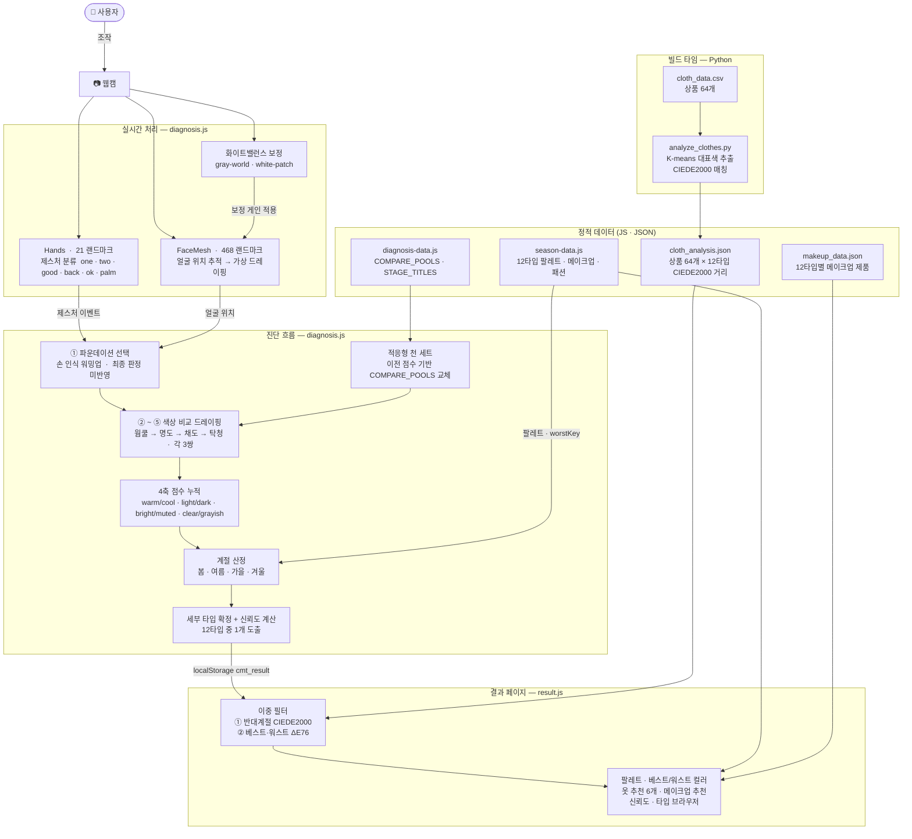

## 데모 링크🔗 [catch-my-tone.vercel.app](https://catch-my-tone.vercel.app)


---

# 1. 프로젝트 소개

**Catch My Tone**은 별도의 앱 설치 없이 브라우저에서<br/>
웹캠과 손동작만으로 [퍼스널컬러](https://www.google.com/search?sca_esv=6a03f9eebeaaf4c7&sxsrf=ANbL-n5HkhhfETwrOUjUP8RQCCRWQaU4xg:1780761966365&udm=2&fbs=ADc_l-bD_nyrjATWBKup7flJ4rea5XFXsPHwMjGsTekJ1HCohLl5jVfW6Wa1gJhEgNeZVlX4vEYjwla_a-g0kroAFGNtlnyBzvrTSCFOEd3uqXcIoAoiOPn0OSJcbh0oAgT3p-KYjdtBJZXaLYgYu-gh2rg5eS1eBJMhXyOueCp9QuFWXYXBUWhEbw-GCwzt9byJgg5UduW9WTTqdM1yCxxfcB59OW2WViA0nzA_Sn6V9XnNG6U5mMw&q=%ED%8D%BC%EC%8A%A4%EB%84%90%EC%BB%AC%EB%9F%AC&sa=X&ved=2ahUKEwiu6byj__KUAxVloK8BHUilGiwQtKgLegQIFRAB&biw=1536&bih=695&dpr=1.25)를 진단하는 웹 서비스입니다! 🎨

퍼스널컬러 진단은 전문 컨설턴트가 실제 색상 천을 얼굴 아래에 대어 비교하는 방식으로 이루어지는 반면, Catch My Tone은 MediaPipe의 얼굴과 손 인식 기술을 활용해 이 과정을 웹 브라우를 통해 구현합니다. 사용자는 화면에 표시되는 가상 색상 천을 손동작으로 바꿔가며 5단계 비교를 완료하면, 봄, 여름, 가을, 겨울 각 3가지씩 총 12가지 세부 타입 중 자신에게 해당하는 타입과 어울리는 팔레트, 패션, 메이크업 아이템 추천을 확인할 수 있습니다.

**주요 특징**

✋ **손동작 기반 인터랙션** — 마우스·터치 없이 제스처로 진단을 진행해요.<br/>
💡 **실시간 색 보정** — 조명 환경에 따른 색감에 대해 자동 화이트밸런싱을 해요.<br/>
👕 **옷·메이크업 추천** — 진단 결과에 맞는 실제 상품을 연동해 추천해요.<br/>
📸 **결과 카드 저장** — 웹캠으로 셀피를 찍어 내 퍼스널컬러 결과 카드 이미지로 저장하고 공유할 수 있어요.

---

# 2. 데모와 사용법

①**홈**(home.html) → ②**진단하기**(diagnose.html) → ③**결과**(result.html) → ④ **퍼스널컬러란?**(about.html)

### ▼ ①-1 홈 진입화면


### ▼ ①-2 카메라 인식 및 진단 알고리즘 설명
Catch my tone에서 사용된 실시간 얼굴 추적, 손동작 인식,<br/>
화이트밸린싱 보정, 진단 알고리즘, 옷 추천 알고리즘에 대해 쉽게 설명합니다.


### ▼ ①-3 Lab 색공간 인터랙티프 그래프
Lab 색공간에 색 점 구름과 옷 대표 색상을 계산해 제품 사진을 배치되어 있습니다.<br/>
스크롤로 회전 및 확대 가능하며, 클릭시 상품 페이지로 이동합니다.


### ▼ ②-1 진단하기 진입화면


### ▼ ②-2 환경 보정 방법 선택
흰 종이 보정 또는 자동 보정 중 보정 방식을 선택할 수 있습니다.


흰 종이 보정 시 박스 안 RGB 측정값을 가장 밝은 영역으로 가정하여 해당 기준값으로 화이트밸런싱을 수행합니다.


### ▼ ②-3 1단계: 파운데이션 선택
검지 끝으로 블럭을 가리켜 피부 베이스 호수를 선택합니다.<br/>
1단계의 결과는 손 인식 모델 테스트 및 워밍업 용도이며, 결과에 반영되지 않습니다.


### ▼ ②-3 2~5단계: 단계별 천 3쌍 비교와 선택
☝️ 1번 혹은 ✌️ 2번 손가락을 바꿔가며 나에게 더 어울리는 드레이프 천을 선택합니다.
👍 손모양을 하면 천이 선택되고, 3쌍의 천을 비교하는 각 단계에서 👌 손모양을 하면 다음 단계로 넘어갑니다.


### ▼ ②-4 이전 단계로
화면의 왼쪽을 가리키는 손등 자세를 1.5초 이상 유지하면 이전 단계로 돌아갑니다.


### ▼ ②-5 분석 완료 안내
5단계까지의 분석을 마치면 최종 분석 결과 페이지 이전에 나의 베스트 톤과 워스트 톤을 드레이프 천으로 확인할 수 있습니다.


☝️ 손모양은 베스트 톤(나의 결과)입니다.


✌️ 손모양은 워스트 톤(나의 결과의 반대톤)이며, 👌 손모양을 하면 최종 결과 페이지로 넘어갑니다.


### ▼ ③-1 최종 분석 결과 페이지
5단계에 거친 분석을 마친 후, 최종 분석 결과입니다.<br/>
대표 톤과 워스트 컬러, 단계별 점수 분포, 패션 컬러 및 제품 추천, 톤별 특징, 추천 메이크업 컬러 및 제품이 보입니다.


### ▼ ③-2 상품 이미지 클릭시 이동
옷 제품과 메이크업 제품 이미지 클릭시 구매 링크로 이동합니다. (메이크업 제품 이미지도 동일)


### ▼ ③-3 결과 카드로 공유하기
[결과 공유하기]를 누르면 내 이름을 입력하고, 프로필 사진과 함께 결과 카드로 저장할 수 있습니다.<br/>
결과 카드를 이미지 파일(.png)로 저장하고 공유할 수 있습니다.


### ▼ ④-1 퍼스널컬러란?
진단에 앞서 퍼스널컬러 자체에 대한 이해를 한 단계 도울 수 있는 페이지입니다.


### ▼ ④-2 각 계절의 세부타입 확인하기
4개의 계절타입은 또다시 3가지 세부타입으로 나뉩니다. 각 세부타입의 팔레트의 특징을 확인할 수 있습니다.


---

# 3. 기술 스택

| 분류 | 사용 기술 |
|---|---|
| 언어 | HTML5, CSS3, JavaScript (Vanilla) |
| 컴퓨터비전 | MediaPipe FaceMesh, MediaPipe Hands |
| 색 과학 | LAB 색공간, CIEDE2000 색차 공식 |
| 3D 시각화 | Three.js (Lab 색공간 시각화) |
| 데이터 분석 | Python, NumPy (옷 색상 사전 분석) |
| 배포 | Vercel |

---

# 4. 핵심 기능

### 4-1. 얼굴 인식 & 가상 드레이핑 (MediaPipe FaceMesh)

MediaPipe FaceMesh로 매 프레임 468개의 얼굴 랜드마크를 추출합니다. 이 중 턱 랜드마크(#152)를 기준으로 가상 색상 천의 상단 위치를 결정하고, 좌우 볼 랜드마크(#234, #454) 간격으로 얼굴 너비를 계산해 천의 크기를 동적으로 조정합니다.

- **천 너비**: 얼굴 너비의 2.8배 (카메라 너비의 72~100% 범위로 제한)
- **천 높이**: 이마(#10)~턱(#152) 거리의 1.7배
- **EMA 스무딩**: `smoothed = prev * (1 - 0.22) + current * 0.22` 비율로 떨림을 제거. 천이 새로 등장할 때는 즉시 해당 위치로 이동

### 4-2. 손동작 인식 (MediaPipe Hands)

MediaPipe Hands로 21개 손 랜드마크를 추출해 6가지 제스처를 분류합니다. 각 제스처는 진단 단계별로 다른 역할을 수행합니다.

| 제스처 | 1단계 | 2~5단계 | 6단계 |
|---|---|---|---|
| ☝️ one | 선택지 가리키기 | 1번 천 선택 | 베스트컬러 천 |
| ✌️ two | — | 2번 천 선택 | 워스트컬러 천 |
| 👍 good | — | 선택 확정 | — |
| 👈 back | — | 이전 단계 이동 | — |
| 🖐 palm | 1.5초 유지 → 초기화 | — | — |
| 👌 ok | 다음 단계 | 다음 단계 | 결과 보기 |

인식 오류 해결을 위해 테스트를 거치며 각 제스처에 엄격한 랜드마크 조건을 적용했습니다. (9-1 참고)


### 4-3. 카메라 색 보정 (화이트밸런스)

조명 환경에 따라 카메라가 색을 왜곡해 퍼스널컬러 진단의 정확도가 떨어질 수 있습니다. 진단 시작 전 두 가지 방식 중 하나를 선택해 화이트밸런스를 보정합니다.

**① 자동 보정 (gray-world)**

화면 네 모서리 픽셀의 RGB를 샘플링해 평균을 구하고, 그 평균이 무채색 회색이 되도록 RGB 각 채널에 배율을 곱합니다. 배경은 평균적으로 무채색에 가깝다는 gray-world 가정을 이용합니다.

```
gain_r = mean(R,G,B) / R_measured
gain_g = mean(R,G,B) / G_measured
gain_b = mean(R,G,B) / B_measured
```

**② 흰 종이 보정 (white-patch)**

사용자가 흰 종이를 화면 중앙 박스에 들면 해당 영역의 RGB를 측정합니다. 가장 밝은 채널 값을 기준(target)으로 삼아 나머지 채널의 배율을 조정합니다. 흰 종이는 모든 채널이 같아야 한다라는 white-patch 원리를 이용합니다.

```
target = max(R, G, B)
gain_r = target / R_measured
gain_g = target / G_measured
gain_b = target / B_measured
```

보정 후에는 추출된 모든 RGB 값에 배율을 곱해 조명 색온도의 영향을 제거합니다.


### 4-4. LAB 색공간 3D 시각화 (Three.js)

알고리즘이 색을 다루는 방식을 눈으로 볼 수 있도록 홈 화면에 3D 색공간 그래프를 구현했습니다.

- **색 점 구름**: 표현 가능한 색상 약 1만 개를 실제 색으로 3D 공간에 배치. 가로·세로·높이 축이 각각 LAB의 a(녹↔빨), b(파↔노), L(어두움↔밝음) 값에 대응됩니다.
- **옷 사진 배치**: 각 옷의 LAB 색상 좌표에 맞춰 썸네일 이미지를 3D 공간 위에 표시. 드래그로 회전하면 옷들이 색에 따라 어디에 모여 있는지 확인할 수 있습니다.
- 썸네일 호버 시 제품명, 클릭 시 상품 페이지로 이동합니다.


### 4-5. 옷 추천 알고리즘 (Python 사전 분석 + JS 런타임 필터)


옷 추천은 **빌드 타임 사전 분석**과 **런타임 이중 필터**의 두 단계로 동작합니다.

#### ① 사전 분석 — `analyze_clothes.py`

서비스 배포 전 Python으로 옷 64벌의 색을 분석해 `cloth_analysis.json`을 생성했습니다.

**이미지에서 대표색 추출**

각 상품의 이미지 URL을 받아 다운로드한 뒤, 흰 배경 제품컷이라는 특성을 활용합니다. 이미지 중앙 60%만 남기고 K-means(k=5)로 클러스터링합니다. 클러스터 중심 중 `min채널 > 215`이고 `채널 편차 < 16`인 클러스터를 배경으로 간주해 제외한 뒤, 나머지 중 가장 픽셀 수가 많은 클러스터를 대표색으로 선택합니다. 대표색은 표준 sRGB → XYZ → LAB 변환을 거쳐 LAB 좌표로 저장됩니다.

**무채색/유채색 분기**

LAB의 채도(`chroma = √(a²+b²)`)가 4.0 미만이면 무채색으로 판정합니다. 무채색은 명도 L* 값만으로 타입을 분류합니다(예: L≥75이면 봄라이트·여름라이트·여름트루). 유채색은 아래 CIEDE2000 매칭 방식을 사용합니다.

**12타입 팔레트와 CIEDE2000 매칭**

유채색 옷에 대해 12타입 각각의 팔레트(타입당 16색)와 CIEDE2000 색차를 계산합니다. 타입별로 16개 색 중 가장 가까운 색까지의 거리를 그 타입의 점수로 사용합니다.

12타입 전체의 점수를 오름차순 정렬해 상위 3개 타입을 `types`에, 12타입 전체 점수를 `scores`에 저장합니다.

#### ② 런타임 필터 — `result.js`

진단 결과 페이지에서 사용자의 타입이 확정되면 `cloth_analysis.json`을 불러와 두 단계 필터를 적용합니다.

**필터 1 — 반대 계절 필터 (CIEDE2000)**

각 옷의 `scores`에서 사용자 타입 점수가 반대 계절 3개 타입 점수의 최솟값 이하인 옷만 통과시킵니다. 반대 계절은 봄↔겨울, 여름↔가을로 정의됩니다.

**필터 2 — 베스트·워스트 근접 필터 (ΔE76)**

각 옷의 LAB 좌표와 사용자 타입의 베스트 컬러 6색·워스트 컬러 6색 사이의 ΔE76 최솟값을 비교합니다. 워스트 컬러보다 베스트 컬러에 더 가까운 옷만 통과합니다.

→ 두 필터를 모두 통과한 아이템을 CIEDE2000 오름차순으로 정렬해 최대 6개를 표시합니다. 6개가 채워지지 않으면 무채색 아이템 중 해당 타입이 포함된 것을 보충합니다.

---


# 5. 퍼스널컬러 진단 알고리즘

진단은 사용자가 직접 진행하는 **5단계**와 자동 계산되는 **계절 산정 + 세부 타입 결정**으로 구성됩니다.

### 1단계 — 베이스 파운데이션 선택

웜/쿨 베이스 파운데이션 호수(13~25호) 중 피부에 맞는 것을 검지로 선택합니다. 이 선택은 최종 계절 판정에 반영되지 않으며, 손 인식 모델 테스트 및 워밍업용입니다.

### 2~5단계 — 4축 색상 비교 드레이핑

각 단계에서 색상 천 3쌍을 실제 얼굴 아래에 비춰 더 어울리는 쪽을 고릅니다. 선택마다 해당 축 점수 +1이 누적됩니다.

| 단계 | 비교 축 |
|---|---|
| 2 | 웜 vs 쿨 |
| 3 | 저명도 vs 고명도 |
| 4 | 저채도 vs 고채도 |
| 5 | 탁색 vs 청색 |

**적응형 천 세트:** 이전 단계의 점수에 따라 다음 단계의 비교 천이 동적으로 교체됩니다. 예를 들어 웜 우세가 확인되면 3단계에서는 웜 명도 천만, 4단계에서는 웜 계열 채도 천만 비교하게 됩니다. 사용자는 자신의 후보 톤에 가장 가까운 색끼리만 비교하기 때문에 케이스 구분 정확도가 높아집니다.

### 계절 산정

5단계 완료 후 4축 점수를 파생 속성(`tone / value / chroma / clarity`)으로 변환해 4계절을 결정합니다.

```
warm + light → 봄    warm + dark → 가을
cool + light → 여름  cool + dark → 겨울
```

톤 또는 명도가 동률이면 채도를 보조 기준으로 사용합니다.

### 세부 타입 결정

계절 + chroma + clarity 조합으로 계절 내 3개 세부 타입 중 하나를 확정해 **총 12타입** 중 하나를 도출합니다.

| 계절 | 세부 타입 조건 |
|---|---|
| 봄 웜 | light+clear → 라이트 / bright+clear → 브라이트 / 그 외 → 트루 |
| 여름 쿨 | light+muted → 라이트 / muted+grayish → 뮤트 / 그 외 → 트루 |
| 가을 웜 | muted+grayish → 뮤트 / dark+muted → 딥 / 그 외 → 트루 |
| 겨울 쿨 | bright+clear → 브라이트 / dark+clear → 딥 / 그 외 → 트루 |

### 신뢰도 계산

4축 각각의 우세도(`|a−b| / (a+b)`) 평균을 50~100% 범위로 정규화합니다. 모든 축에서 한쪽이 압도적이면 100%에 가까워지고 전 축이 박빙이면 50%입니다.

```
confidence = round( Σ(|a−b| / (a+b)) / 4 × 50 + 50 )
```


---

# 6. 시스템 아키텍처




---

# 7. 프로젝트 구조

```
catch-my-tone/
│
├── index.html              # 랜딩 + 기술 소개 통합 페이지
├── about.html              # 퍼스널컬러 소개 페이지
├── diagnosis.html          # 웹캠 진단 UI
├── result.html             # 진단 결과 페이지
├── spring.html             # 봄 웜톤 세부 타입 소개
├── summer.html             # 여름 쿨톤 세부 타입 소개
├── autumn.html             # 가을 웜톤 세부 타입 소개
├── winter.html             # 겨울 쿨톤 세부 타입 소개
│
├── css/
│   └── style.css           # 전체 스타일 (CSS 변수 기반 계절 테마 포함)
│
├── js/
│   ├── main.js             # 공통 유틸리티 (네비게이션 등)
│   ├── season-data.js      # SEASON_INFO — 12타입 팔레트·메이크업·패션 데이터
│   ├── diagnosis-data.js   # 진단 상수 (STAGE_TITLES, COMPARE_STAGES, COMPARE_POOLS)
│   ├── diagnosis.js        # 진단 전체 로직 (MediaPipe, 제스처, 단계 관리, 분석)
│   ├── result.js           # 결과 페이지 렌더링 로직
│   └── lab3d.js            # Lab 색공간 3D 시각화 (Three.js)
│
├── data/
│   ├── cloth_analysis.json # 상품 64개 퍼스널컬러 매칭 결과 (CIEDE2000 거리)
│   ├── makeup_data.json    # 12타입별 메이크업 제품 추천
│   ├── cloth_data.csv      # 상품 원본 데이터 (id, 브랜드, 가격, URL)
│   └── analyze_clothes.py  # cloth_analysis.json 생성 배치 스크립트
│
├── images/
│   ├── catch_my_tone_logo.png
│   └── bunny/              # 토끼 마스코트 이미지 (포즈별·계절별)
│
└── vendor/
    └── mediapipe/          # MediaPipe Hands & FaceMesh 로컬 번들
```

---

# 8. 로컬 실행 방법

웹캠과 `fetch()` API 사용을 위해 반드시 HTTP 서버를 통해 실행해야 합니다.<br/>
`file://` 프로토콜로는 동작하지 않습니다.

이때 웹캠 데이터는 외부 서버로 전송되지 않으며,<br/>
모든 처리는 브라우저 내에서만 이루어집니다.

### 권장 환경

| 항목 | 요구사항 |
|---|---|
| 브라우저 | **Chrome 최신 버전** 권장 (Firefox 가능 / Safari 미지원) |
| 하드웨어 | 웹캠 |
| 조명 | 얼굴에 고른 조명이 들어오는 밝은 환경 |

> MediaPipe는 WebGL을 사용합니다. Safari는 WebGL 구현 차이로 동작하지 않을 수 있습니다.

### VS Code Live Server 사용 (권장)

1. VS Code에서 프로젝트 폴더를 열기
2. [Live Server](https://marketplace.visualstudio.com/items?itemName=ritwickdey.LiveServer) 확장 설치
3. `index.html` 우클릭 → **Open with Live Server**
4. 브라우저에서 `http://127.0.0.1:5500` 접속

### Python 내장 서버 사용

```bash
python -m http.server 5500
```

브라우저에서 `http://localhost:5500` 접속


---

# 9. 문제 해결


### 9-1. 제스처 오인식 (good ↔ back ↔ ok)

손을 자연스럽게 쥐거나 반쯤 접는 순간에 의도치 않은 제스처가 인식되는 문제가 있었습니다.

**해결**: 각 제스처에 복합 조건을 적용했습니다.
- 👍 good: 엄지 끝이 손목보다 위여야 하고, 나머지 손가락은 PIP 관절 기준 완전 접힘. 검지 수평 이탈(`lxDelta > 0.12`) 시 비활성화
- 👈 back: 수평 각도 34° 이내, pinch 거리(`> 0.15`)로 👌와 구분, 1.5초 홀드 방식으로 carry-over 방지
- 👌 ok: 단계 전환 후 `lastGestureTime` 리셋으로 carry-over 방지

### 9-2. 피해야 할 색상의 옷이 추천되는 문제

초기 알고리즘은 옷의 색상과 사용자 타입 팔레트 사이의 CIEDE2000 거리를 오름차순 정렬해 상위 아이템을 추천했습니다. 거리가 가까운 순으로만 보여주다 보니, 사용자 타입에도 어느 정도 가깝지만 반대 계절(워스트) 팔레트에도 동시에 가까운 애매한 색상의 옷이 추천되는 문제가 있었습니다.

**해결**: 두 단계 필터를 추가했습니다.

**① 반대 계절 필터**: 옷의 CIEDE2000 거리가 사용자 타입보다 반대 계절 3개 타입 중 어느 하나에 더 가까우면 제외합니다.

```
scores[내 타입] <= min(scores[반대 계절 타입 3개])  →  통과
```

예를 들어 봄 웜톤 사용자라면, 겨울 계열 팔레트보다 봄 계열 팔레트에 더 가까운 옷만 남깁니다.

**② 베스트·워스트 근접 필터**: 각 옷의 LAB 색상과 베스트 컬러 6색 / 워스트 컬러 6색 사이의 최소 ΔE76 거리를 비교해, 워스트 컬러보다 베스트 컬러에 더 가까운 옷만 추천합니다.

```
min_dist(옷, 워스트 컬러) >= min_dist(옷, 베스트 컬러)  →  통과
```

두 필터를 모두 통과한 아이템만 최종 추천 목록에 포함됩니다.


---

# 10. 라이센스

이 프로젝트의 소스 코드는 **MIT License**를 따릅니다.

### 사용된 오픈소스 라이브러리

| 라이브러리 | 라이센스 |
|---|---|
| [MediaPipe](https://github.com/google/mediapipe) | Apache 2.0 |
| [Three.js](https://github.com/mrdoob/three.js) | MIT |

### 데이터 관련

상품 이미지·가격·링크 등 제품 데이터의 저작권은 각 브랜드 및 판매처에 있습니다.<br/>
수집된 데이터는 학습 및 테스트 목적으로만 사용되었습니다.

- **옷 데이터**: 직접 수집
- **화장품 데이터**: Claude deep research + 직접 수집

---

# 11. 참고 및 감사 인사
* 한국분장예술인협회 퍼스널 컬러 컨설턴트 필기 자료
  : https://www.kmaa.or.kr/main/qexa/qexa14.php
* 코드 작성 및 피드백 과정: Claude
* 이미지 생성: ChatGPT


훌륭한 AI 도구를 개발해 주신 모든 연구자와 개발자분들께 감사드립니다. 🧡
